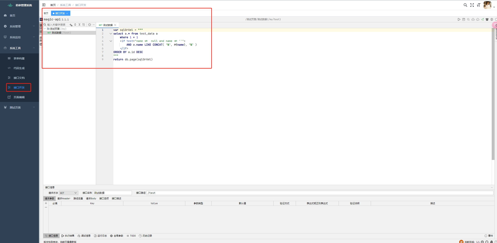
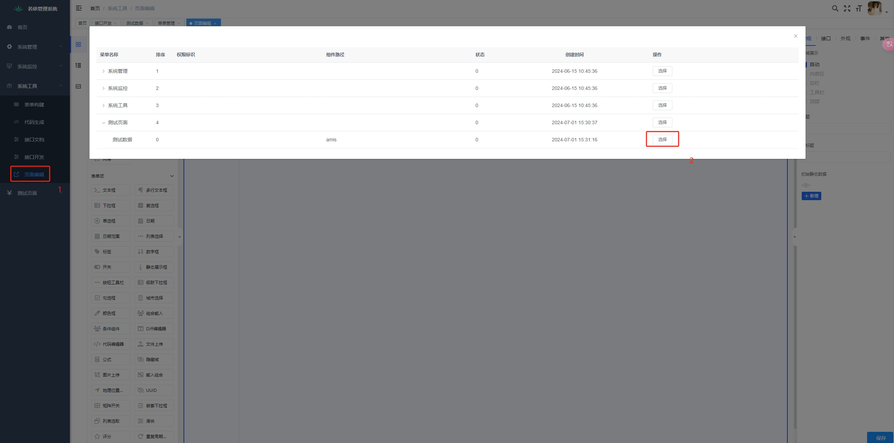
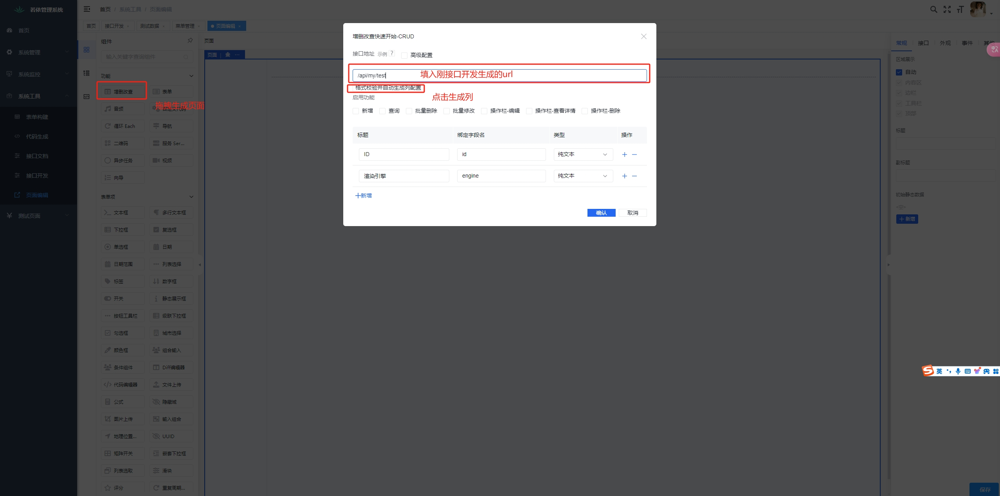
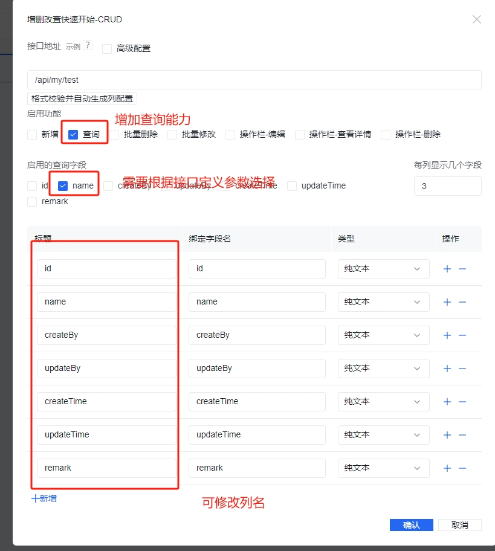
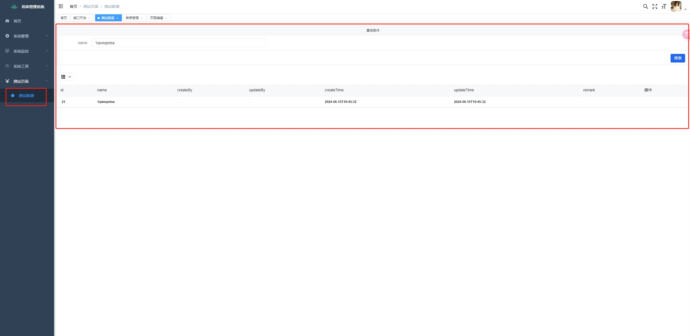
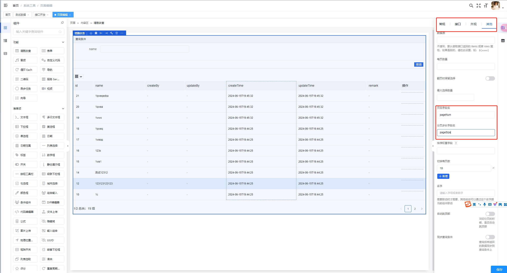

## 平台简介
若依是一套全部开源的快速开发平台，毫无保留给个人及企业免费使用
此项目根据若依魔改，增加业务模块，支持mybaties-plus，同时修改接口返回值，支持yapi接口一键导出，方便后端生成接口
支持若依自带功能开发：https://ruoyi.vip/
支持magic-api在线接口开发：https://www.ssssssss.org/magic-api/
支持amis在线页面开发 ：https://aisuda.bce.baidu.com/amis/zh-CN/docs/index
提供dockerfile脚本一键部署 
类似低代码平台
便于后端人员一键建站

## 喜欢欢迎给个star

## 内置功能

1.  用户管理：用户是系统操作者，该功能主要完成系统用户配置。
2.  部门管理：配置系统组织机构（公司、部门、小组），树结构展现支持数据权限。
3.  岗位管理：配置系统用户所属担任职务。
4.  菜单管理：配置系统菜单，操作权限，按钮权限标识等。
5.  角色管理：角色菜单权限分配、设置角色按机构进行数据范围权限划分。
6.  字典管理：对系统中经常使用的一些较为固定的数据进行维护。
7.  参数管理：对系统动态配置常用参数。
8.  通知公告：系统通知公告信息发布维护。
9.  操作日志：系统正常操作日志记录和查询；系统异常信息日志记录和查询。
10. 登录日志：系统登录日志记录查询包含登录异常。
11. 在线用户：当前系统中活跃用户状态监控。
12. 定时任务：在线（添加、修改、删除)任务调度包含执行结果日志。
13. 代码生成：前后端代码的生成（java、html、xml、sql）支持CRUD下载 。
14. 系统接口：根据业务代码自动生成相关的api接口文档。
15. 服务监控：监视当前系统CPU、内存、磁盘、堆栈等相关信息。
16. 缓存监控：对系统的缓存信息查询，命令统计等。
17. 在线构建器：拖动表单元素生成相应的HTML代码。
18. 连接池监视：监视当前系统数据库连接池状态，可进行分析SQL找出系统性能瓶颈。

新增功能如下

